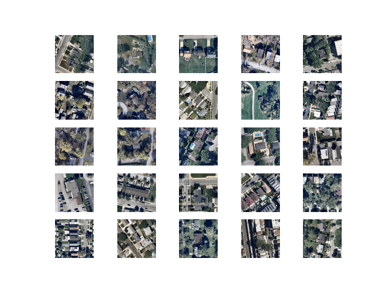
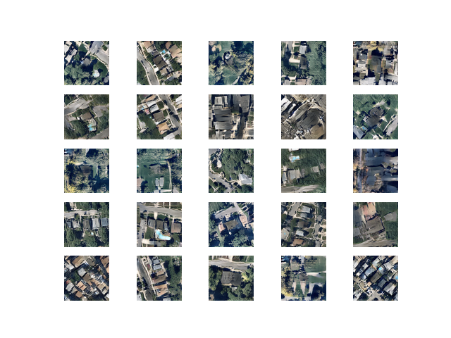

**Implementation/Documentation/review by Taihui Li, RA, assisting the research agenda of Vahan M. Misakyan 
© Surveillant City Lab 2018-19**

&nbsp;
&nbsp;


# Generative Adversarial Network (GAN) 

This repo conducts the image synthesis. In particular, it learns the pattern of images (cities/buildings) and then generates images with similar patterns. This implementation mainly follows the DCGAN paper which can be found [here](https://arxiv.org/abs/1511.06434).


## Table of Contents

1. [Environment Setting Up](#1-environment-setting-up)<br>
    1.1 [Required Dependencies](#11-required-dependencies)<br>
    1.2 [Installation Guide](#12-installation-guide)<br>
    1.3 [Get Dataset](#13-get-dataset)<br>
2. [Scripts/Directories Introduction](#2-scriptsdirectories-introduction)
3. [Usage](#3-usage)<br>
    3.1 [Train Model](#31-train-model)<br>
    3.2 [Use Model](#32-use-model)<br>
    3.3 [Sample Result](#33-sample-result)
4. [State of The Art](#4state-of-the-art)
5. [Further Reading](#5-further-reading)
6. [Reference](#reference)


## 1 Environment Setting Up

### 1.1 Required Dependencies
* [Tensorflow 1.14.0](https://www.tensorflow.org/).
* [Keras 2.2.4](https://keras.io/).
* [Python3.6](https://www.python.org/download/releases/3.0/).
* [Pillow 2.2.1](https://pypi.org/project/Pillow/2.2.1/).
* [imageio 2.5.0](https://pypi.org/project/imageio/).
* [imageio-ffmpeg](https://pypi.org/project/imageio-ffmpeg/).
* [matplotlib](https://matplotlib.org/).

### 1.2 Installation Guide
Note: If you are going to use AWS, please also visit the [AWS Guidance](https://github.com/taihui/RA_Summer2019/tree/master/4_image_synthesis/4_3_AWS).

1. Create a virtual environment named ```DCGAN``` (the benefit of using virtual environment can be found [here](https://www.geeksforgeeks.org/python-virtual-environment/)):

   ```
   $ conda create -n DCGAN python=3.6
   ```

2. Activate your virtual environment (all the following steps will be done in this activated virtual environment):

   ```
   $ source activate DCGAN 
   ```

   OR you can use:

   ```
   $ conda activate DCGAN
   ```

3. Install tensorflow gpu version (more details can be found [here](https://www.tensorflow.org/install)):

   ```
   $ conda install -c anaconda tensorflow-gpu 
   ```

4. Install keras:

   ```
   $ conda install -c anaconda keras-gpu 
   ```
5. Install Pillow:

   ```
   $ conda install -c anaconda pillow 
   ```
   
6. Install imageio:

   ```
   $ conda install -c menpo imageio 
   ```
   
7. Install imageio-ffmpeg:

   ```
   $ conda install -c conda-forge imageio-ffmpeg 
   ```
   
8. Install matplotlib:

   ```
   $ conda install -c conda-forge matplotlib  
   ```

9. After installing dependencies, you can deactivate your virtual environment:

   ```
   $ source deactivate
   ```

   Or you can use:

   ```
   $ conda deactivate
   ```

### 1.3 Get Dataset

* Download the dataset from [here](https://drive.google.com/open?id=1gkqy-wFkY-5iIq93wOWJjEDPD9lxDiN8).
* Or, you can follow the procedure in [4_1_satellite_imagery](https://github.com/taihui/RA_Summer2019/tree/master/4_image_synthesis/4_1_satellite_imagery) to prepare your dataset.
  


## 2 Scripts/Directories Introduction
This section introduces the scripts and directories in this implement code. The directory structure tree is shown below:
```
.
├── dataset
|     ├── images                    /* The training dataset (format and image resolution don't matter)
├── model_figure                    /* The network architecture
├── training_results
|     ├── models                    /* The produced model
|     ├── plots                     /* The training processing plot
├── use_results                     /* The usage result
├── state_of_the_art_papers         /* The directory where the state-of-the-art papers are resided.
├── DCGAN.py                        /* The core code which defines the generator, discriminator, and dcgan.
├── util.py                         /* Defines gloabl functions and variables.
├── train.py                        /* The code used to train the model.
├── Useit.py                        /* The usage API.
├── imagePreProcessing.py           /* The code used to prprocesing dataset.
```


## 3 Usage
### 3.1 Train Model
What if you have your own images dataset (e.g., a set of building/bridge/... images) and you want to train a model that is able to generate images similar to what you have? The good news is that you can always retrain the model with your own dataset.

1. Please place your images under the floder ```dataset/images/```.

2. Activate your virtual environment:
```
$ source activate DCGAN
```
Or you can use:
```
$ conda activate DCGAN
```
3. Train your model:
```
python train.py [options]
```
Note you can change the training setting by taking the advantages of ```[options]```. The ```[options]``` is list below.
```
'--image_dir', type=str, default='dataset/images/', help='The dataset location')

'--inputfile_dir', type=str, default='dataset/preprocessing_result/city_64.npz', help='The preprocessing dataset location')

'--IMAGE_RESO', type=int, default= 64, help='The image resolution')

'--latent_dim', type=int, default=100, help='The latent sapce vector size')

'--n_epochs', type=int, default=10000, help='The training epoch')

'--n_batch', type=int, default=32, help='The batch size')
```
In particular, ```--IMAGE_RESO``` indicates the images resolution we want GAN to generate. For example, its default value is 64, which means GAN will generate ```64 * 64``` iamge for us. If you need a higher resolution image, you can set it to be, for example, ```128 * 128```, ```512 * 512``` and so on. However, higher resolution image requires more resource to train and will take longer and sometimes its convergence is not guaranteed, which means it is possible to fail.

4. Check your customize model in the folder ```training_results/models/```.

### 3.2 Use Model
If you just want the model to generate some images which look like a city or some buildings, you can always use the pre-trained model under ```training_results/models```. There might have a lot of models, you can see how each model works by referring to the plot figures under ```training_results/plots```.

After deciding which model to use, you can use it effortless by running command ```python Useit.py [options]```. The result can be found under ```use_results```.

The ```[options]``` is list below.
```
'--model_name', type=str, default='training_results/models/generator_model_350.h5', help='The model to use'

'--video_name', type=str, default='use_results/gan.mp4', help='The result video name'

'--plot_name', type=str, default='use_results/gan.png', help='The result plot name'

'--n_samples', type=int, default=100, help='The number of samples want to generate'

'--row_col', type=int, default=10, help='The plot rows and columns'
```

### 3.3 Sample Result
Figure 1 shows a sample of generating result. Please note that the iamge resolution is only ```64 * 64```, thus it is not supposed to be as fidelity as the original dataset since the resolution of original dataset is ```600 * 600```. Also, the Figure 2 is genereate by the model under 650 epochs. The training process is still on going. It is supposed/expected to be better with more training epochs. 

(***Note:*** Training will take less or longer time depending on your computer or server. I use a computer with 16G RAM, Intel Core i7, GPU GeForce GTX 965M 4G. It took around 48 hours to get the epoch 650 model.)

<div align="center">
<figure>
<p>
<figcaption>Figure 1 Original Image Samples</figcaption>
</figure>
</div>

<div align="center">
<figure>
<p>
<figcaption>Figure 2 Generated Image Samples</figcaption>
</figure>
</div>


## 4 State of The Art

1. [Generative Adversarial Nets](https://arxiv.org/pdf/1406.2661v1.pdf).
2. [Unsupervised Representation Learning with Deep Convolutional Generative Adversarial Networks](https://arxiv.org/pdf/1511.06434.pdf).
3. [Conditional Generative Adversarial Nets](https://arxiv.org/pdf/1411.1784.pdf).
4. [InfoGAN: Interpretable Representation Learning by Information Maximizing Generative Adversarial Nets](https://arxiv.org/pdf/1606.03657.pdf).
5. [Conditional Image Synthesis With Auxiliary Classifier GANs](https://arxiv.org/pdf/1610.09585.pdf).
6. [Semi-supervised learning based on generative adversarial network: a comparison between good GAN and bad GAN approach](https://arxiv.org/pdf/1905.06484.pdf).
7. [Least Squares Generative Adversarial Networks](https://arxiv.org/pdf/1611.04076.pdf).
8. [Wasserstein GAN](https://arxiv.org/pdf/1701.07875.pdf).
9. [Image-to-Image Translation with Conditional Adversarial Networks](https://arxiv.org/pdf/1611.07004.pdf).
10. [Unpaired Image-to-Image Translation using Cycle-Consistent Adversarial Networks](https://arxiv.org/pdf/1703.10593.pdf).
11. [A Style-Based Generator Architecture for Generative Adversarial Networks](https://arxiv.org/pdf/1812.04948.pdf).
12. [Progressive Growing of GANs for Improved Quality, Stability, and Variation](https://arxiv.org/pdf/1710.10196.pdf).
13. [Large Scale GAN Training for High Fidelity Natural Image Synthesis](https://arxiv.org/pdf/1809.11096.pdf).


## 5 Further Reading

1. [A Tour of Generative Adversarial Network Models](https://machinelearningmastery.com/tour-of-generative-adversarial-network-models/).
2. [A Gentle Introduction to Generative Adversarial Networks (GANs)](https://machinelearningmastery.com/what-are-generative-adversarial-networks-gans/).
3. [18 Impressive Applications of Generative Adversarial Networks (GANs)](https://machinelearningmastery.com/impressive-applications-of-generative-adversarial-networks/).
4. [How to Train Keras Deep Learning Models on AWS EC2 GPUs (step-by-step)](https://machinelearningmastery.com/develop-evaluate-large-deep-learning-models-keras-amazon-web-services/).


## Reference
1. [A Survey of Image Synthesis and Editing with Generative Adversarial](https://ieeexplore.ieee.org/document/8195348).
2. [An Introduction to Image Synthesis with Generative Adversarial Nets.pdf](https://arxiv.org/abs/1803.04469).
3. [Unsupervised Representation Learning with Deep Convolutional Generative Adversarial Networks](https://arxiv.org/abs/1511.06434).


