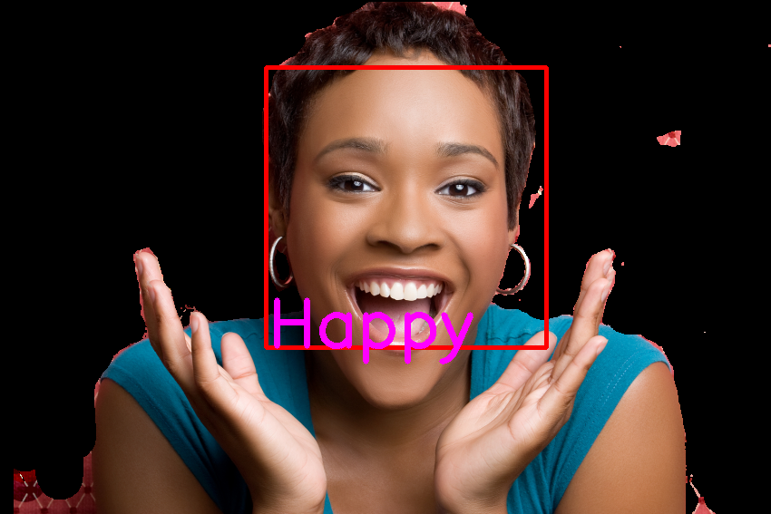
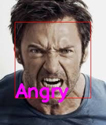
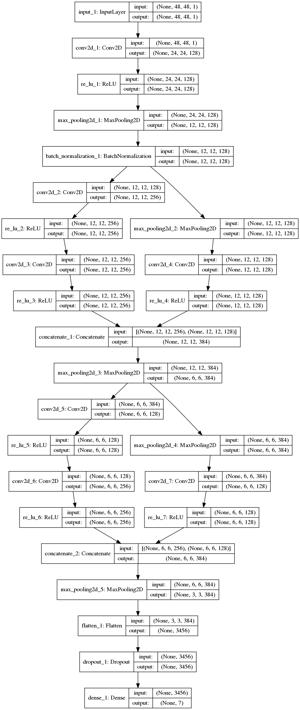

**Documentation/Implementation by Taihui Li, RA, assisting the research of Vahan M. Misakyan ©SurveillantCityLab 2018-19**


&nbsp;
&nbsp;
&nbsp;

# Facial Emotion Recognition (FER)

This FER code follows the idea (network structure) proposed in the paper [DeXpression: Deep Convolutional Neural Network for Expression Recognition](https://arxiv.org/abs/1509.05371). The detailed network structure is presented in Figure 4, Section 5. 

The dataset used to train the neural network is [Fer2013](https://www.kaggle.com/c/challenges-in-representation-learning-facial-expression-recognition-challenge/data). The dataset include 28,709 examples in its traning set, 3,589 examples in its public test set (I used it as the validation set), and 3,589 examples in its private test set (I used it as the test set).


## Table of Contents

1. [Environment Setting Up](#1-environment-setting-up)<br>
   1.1 [Required Dependencies](#11-required-dependencies)<br>
   1.2 [Installation Guide](#12-installation-guide)<br>
2. [Scripts/Directories Introduction](#2-scriptsdirectories-introduction)
3. [Usage](#3-usage)<br>
   3.1 [Train your own model](#31-train-your-own-model)<br>
   3.2 [Use it directly](#32-use-it-directly)<br>
4. [Test Examples](#4-test-examples)
5. [Neural Network Architecture](#5-neural-network-architecture)
6. [State of The Art](#6-state-of-the-art)
7. [Reference](#reference)

## 1 Environment Setting Up

### 1.1 Required Dependencies
* [Tensorflow 1.14.0](https://www.tensorflow.org/).
* [Keras 2.2.4](https://keras.io/).
* [Python3](https://www.python.org/download/releases/3.0/).
* [opencv-python](https://pypi.org/project/opencv-python/).
* [Pillow 6.1.0](https://pypi.org/project/Pillow/).
* [pandas](https://pandas.pydata.org/pandas-docs/stable/install.html).
* [matplotlib](https://matplotlib.org/).
* [pydot](https://pypi.org/project/pydot/).

### 1.2 Installation Guide

1. Create a virtual environment named ```FER``` (the benefit of using virtual environment can be found [here](https://www.geeksforgeeks.org/python-virtual-environment/)):

   ```
   $ conda create -n FER python=3.6
   ```

2. Activate your virtual environment (all the following steps will be done in this activated virtual environment):

   ```
   $ source activate FER 
   ```

   OR you can use:

   ```
   $ conda activate FER
   ```

3. Install tensorflow:

   ```
   $ pip install tensorflow  
   ```

4. Install keras:

   ```
   $ pip install keras
   ```

5. Install opencv-python:

   ```
   $ pip install opencv-python
   ```

6. Install pillow:

   ```
   $ pip install Pillow
   ```

7. Install pandas:

   ```
   $ pip install pandas
   ```

8. Install matplotlib:

   ```
   $ pip install matplotlib
   ```

9. Install pydot:

   ```
   $ pip install pydot
   ```

   

## 2 Scripts/Directories Introduction

This section introduces the scripts and directories in this implement code.

```
.
├── data
|   ├── original                 /* The original dataset (csv version).
|   ├── train                    /* The training dataset (0~6 represent different emotions).
|   |   ├── 0
|   |   .
|   |   .
|   |   .
|   |   ├── 6
|   ├── val                      /* The validation dataset (0~6 represent different emotions).
|   |   ├── 0
|   |   .
|   |   .
|   |   .
|   |   ├── 6
|   ├── test                     /* The test dataset (0~6 represent different emotions).
|   |   ├── 0
|   |   .
|   |   .
|   |   .
|   |   ├── 6
├── state_of_the_art_papers      /* The directory where the state-of-the-art papers are resided.
├── model                        /* The directory where the trained model is resided.
├── test_and_result              /* The directory where the test images and the results are resided.
├── GenerateData.py              /* The code to generate the data we need in order to train our model.
├── DexFERNet.py                 /* The core of the implementation. It defines the network structure, sets up parameters.
├── train.py                     /* The code used to train the model.
├── EmotionRec.py                /* The usageAPI that uses the trained model to recognize facial emotion in images.

```


## 3 Usage

### 3.1 Train your own model
What if you have a dataset and want to re-train your own model? It is possible to re-train and get your own model by using your own images/dataset. It is much easier to prepare your dataset in the format like [Fer2013](https://www.kaggle.com/c/challenges-in-representation-learning-facial-expression-recognition-challenge/data). In that case, you only need to place your csv file into ```dataset/original/```. Optionally, you could use the raw images directly. In that case, you should follow the files structures in Section 2 very carefully in order to place your images in the right places.

1. Place your dataset to the proper directory. Typically, the training dataset should consist of around 80% of your dataset while validation dataset consist of around 20% of your dataset.  (This only works for 'csv' case.)

   ```
   .
   ├── data
   |    ├── original					/* The original dataset.
   ```

2. Train your model:

   ```
   $ python train.py [options]
   ```

   The ```[options]``` are list below:

```
'--imagesize', type=int, default=48, help='The image resolution to be used'

'--opt_method', type=str, default='Adam', help='The optimizer to be used (options: Adam, Adamax, Nadam, SGD, RMSprop)'

'--learning_rate', type=float, default=0.001, help='The learning rate'

'--num_epoch', type=int, default=100, help='The epochs to train the model'

'--batchsize', type=int, default=256, help='The batch size'

'--model_path', type=str, default='model/FERModel.h5', help='The directory to save trained model'

'--dataset_type', type=str, default='csv', help='The dataset type to train the model (options: csv, image)'

'--root_path', type=str, default='dataset', help='The root path of dataset'

'--originaldatapath', type=str, default='dataset/original/fer2013.csv', help='Only set this when you use csv as dataset_type'
```


3. After training, your model will be generated and locates at ```model/```.

### 3.2 Use it directly

You can also use the model we have provided in the directory "model/" to test your images. It supports images facial expression recognition and videos facial expression recognition. 

1. Place your images or videos in your favorite directory (location). 

2.  Run the command below:

   ```
   $ python EmotionRec.py [options]
   ```

   The ```[options]``` are list below:

   ```
   '--modelpath', type=str, default='model/FERModel.h5', help='The FER model to be used'
   
   '--imagepath', type=str, default='test_and_result/test_images/', help='The images directory'
   
   '--videopath', type=str, default='test_and_result/test_videos/', help='The videos directory'
   
   '--imagesize', type=int, default=48, help='The size of image'
   
   '--type_tag', type=int, default=0, help='0:images; 1: videos'
   ```

   

**Labels of emotions**

`0:Angry, 1:Disgust, 2:Fear, 3:Happy, 4:Sad, 5:Surprise, 6:Neutral`


## 4 Test Examples
The following figures show some of recognition results by using our trained model. More results can be found in directory "test_and_result/result_images/".

<div align="center">


</div>


## 5 Neural Network Architecture
The following figure shows the detailed architecture of the neural network.

<div align="center">

</div>

## 6 State of The Art

1. [Covariance Pooling For Facial Expression Recognition](https://arxiv.org/pdf/1805.04855v1.pdf).
2. [Greedy Search for Descriptive Spatial Face Features](https://arxiv.org/pdf/1701.01879v2.pdf).
3. [DeXpression: Deep Convolutional Neural Network for Expression Recognition](https://arxiv.org/pdf/1509.05371v2.pdf).
4. [Frame Attention Networks for Facial Expression Recognition in Videos](https://arxiv.org/pdf/1907.00193v1.pdf).
5. [FERAtt: Facial Expression Recognition with Attention Net](https://arxiv.org/pdf/1902.03284v1.pdf).
6. [Deep Facial Expression Recognition: A Survey](https://arxiv.org/pdf/1804.08348v2.pdf).
7. [MicroExpNet: An Extremely Small and Fast Model For Expression Recognition From Frontal Face Images](https://arxiv.org/pdf/1711.07011v3.pdf).
8. [Island Loss for Learning Discriminative Features in Facial Expression Recognition](https://arxiv.org/pdf/1710.03144v3.pdf).
9. [Facial Expression Recognition using Convolutional Neural Networks: State of the Art](https://arxiv.org/pdf/1612.02903v1.pdf).
10. [Training Deep Networks for Facial Expression Recognition with Crowd-Sourced Label Distribution](https://arxiv.org/pdf/1608.01041v2.pdf).

## Reference

1. [DeXpression: Deep Convolutional Neural Network for Expression Recognition](https://arxiv.org/abs/1509.05371).
2. [Keras Model (functional API)](https://keras.io/models/model/).
3. [How to use Keras fit and fit_generator (a hands-on tutorial)](https://www.pyimagesearch.com/2018/12/24/how-to-use-keras-fit-and-fit_generator-a-hands-on-tutorial/).

