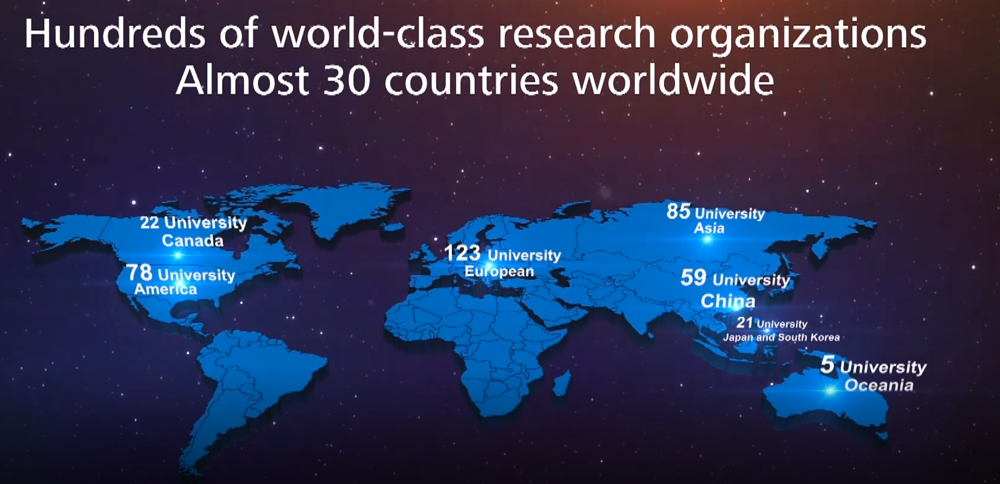
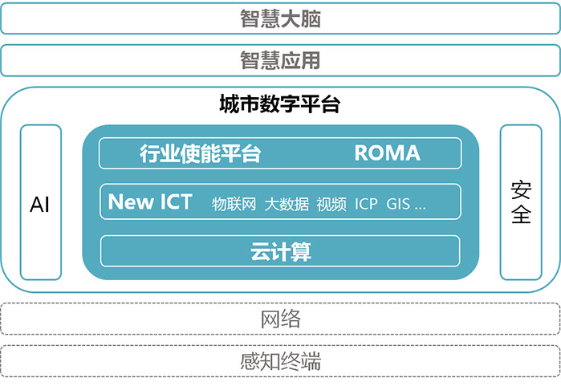
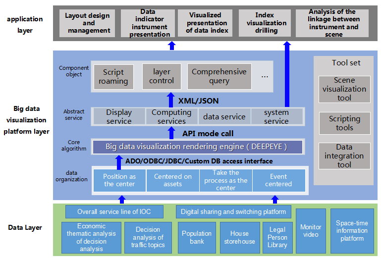

**Documentation/review by Taihui Li, research work under the supervision of Vahan M. Misakyan**

&nbsp;
&nbsp;
&nbsp;

# Huawei Smart Cities

## Table of Contents

1. [Huawei Research & University Partnership](#1-huawei-research-&-university-partnership) 
  1.1 [Huawei Innovation Research Program](#11-huawei-innovation-research-program) 
  1.2 [Huawei Seeds for the Future Program](#12-huawei-seeds-for-the-future-program)
2. [Smart Cities](#2-smart-cities) 
  2.1 [Intelligent Operation Center (IOC)](#21-intelligent-operation-center-ioc)
3. [Smart Transportation](#3-smart-transportation)

## 1 Huawei Research & University Partnership
### 1.1 Huawei Innovation Research Program

[Huawei Innovation Research Program (HIRP)](http://innovationresearch.huawei.com/IPD/hirp/portal/index.html) provides funding opportunities to leading universities and research institutes conducting innovative research in communication technology, computer science, engineering, and related fields. Since 1999, HIRP has sponsored groundbreaking  Information and Communications Technologies (ICT) research at leading universities and research institutes. HIRP seeks to identify and support world-class, full-time faculty members pursuing innovation of mutual interest. Outstanding HIRP winners may be invited to establish further long-term research collaboration with Huawei.As of today, up to hundreds of world-class research organizations almost 30 countries worldwide have enjoyed funding toward new discoveries in exciting areas.

<figure>

<figcaption>Figure 1 HIRP Distribution</figcaption>
</figure>

### 1.2 Huawei Seeds for the Future Program

[Huawei Seeds for the Future Program](https://www.huawei.com/us/about-huawei/sustainability/win-win-development/social-contribution/seeds-for-the-future), initiated in 2008, is Huawei's global Corporate Social Responsibility (CSR) flagship program. The program seeks to develop local Information and Communications Technologies (ICT) talent, enhance knowledge transfer, promote a greater understanding of and interest in the telecommunications sector, and improve and encourage regional building and participation in the digital community.

By the end of 2017, the Seeds for the Future Program has had participants from 108 countries and regions. To date, the program has benefited over 30,000 students from more than 350 universities worldwide. Through this program, a total of 3,600 top college students have been able to visit and study at Huawei's headquarters in China.

**References Readings**
* [Huawei Research_University Partnership](https://github.com/taihui/RA_Summer2019/blob/master/1_huawei_smart_city/references/research_funding/1-Huawei%20Research_University%20Partnership.pdf)
* [Seeds-for-the-future-v1](https://github.com/taihui/RA_Summer2019/blob/master/1_huawei_smart_city/references/research_funding/2-seeds-for-the-future-v1.pdf)

## 2. Smart Cities

Huawei's joint solution partners use Huawei's new Information and Communications Technologies (ICT) such as 5G, AI, cloud computing, Internet of Things, and mobile internet. Based on Huawei's digital platform, they use their extensive industry experience and excellent practices to jointly develop smart city joint solutions ([[link]](https://e.huawei.com/cn/marketplace/industries/smartcity)). The framework of smart cities can be seen as below:

<figure>

<figcaption>Figure 2 Framework of Smart Cities</figcaption>
</figure>

### 2.1 Intelligent Operation Center (IOC)

The smart city Intelligent Operation Center(IOC) ([[*link1*]](https://e.huawei.com/en/marketplace/schemelist/schemedetail?id=a1Z0K000003kvOXUAY)[[*link2*]](https://e.huawei.com/en/marketplace/schemelist/schemedetail?id=a1Z0K000003kziNUAQ)) is the "brain" of the smart city for the decision makers. Its mainly functions include overall situation, decision support, monitoring and warning, linkaged command, and comprehensive governance. This solution is a high reliable, scalable, free maintenance and fast deployment cloud services based on Huawei FusionSphere and FusionStage Cloud Architecture, to provide visualized monitoring, remote dispatching and commanding, and also crossing domain data consolidation. This solution is also validated with Huawei FusionInsight big data platform, by combining with the professional data analysis model (economy analysis model, security assessment model, traffic analysis model, etc.) to provide efficient decision making support. Through Ray_BDV big data visualization platform together with 3D GIS, VR, AR and other advanced data visualization technology to satisfy visualization of urban administration at all levels.

The overall architecture is divided into data layer, big data visualization platform layer and application layer. 

(1) data layer: Data layer to acquire data from application module, data sharing and exchange platform and legacy application systems. 

(2) big data visualization platform layer: The massive data of the city including economy, traffic, security, citizen's livelihood, government services and also fundamental data like demography, housing, legal person and other categories of information is processed in IOC. A professional big data visualization platform with 3D capabilities to statically and dynamically render the urban operational signs to the government decision makers, industrial users and the public to endow wisdom to the city.

(3) application layer: The application layer mainly provides layout design, data configuration and effect configuration for the display of dashboard, and can realize the presentation of data index instrument, visualization of data index, visualization drilling of data index, and linkage analysis of instrument and scene according to the design and related configuration. 

<figure>

<figcaption>Figure 3 Huawei IOC Solution</figcaption>
</figure>

**The infrastructures/products Huawei porvided:**
* FusionInsight Big Data Analytics Platform
* FusionSphere Cloud Operating System	

**The infrastructures/products Partner(s) porvided:**
* Ray_BDV big data visualization platform ([Ruicheng](http://www.resafety.com))

**References Reading**
* [华为&北京睿呈时代信息科技有限公司联合解决方案主打胶片](https://github.com/taihui/notebook/blob/master/huawei/references/smart_cities/%E5%8D%8E%E4%B8%BA%26%E5%8C%97%E4%BA%AC%E7%9D%BF%E5%91%88%E6%97%B6%E4%BB%A3%E4%BF%A1%E6%81%AF%E7%A7%91%E6%8A%80%E6%9C%89%E9%99%90%E5%85%AC%E5%8F%B8%E8%81%94%E5%90%88%E8%A7%A3%E5%86%B3%E6%96%B9%E6%A1%88%E4%B8%BB%E6%89%93%E8%83%B6%E7%89%87.pdf)

2.2 Urban Digital Platform 

2.3 Intelligent IoT

## 3. Smart Transportation 

