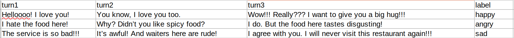
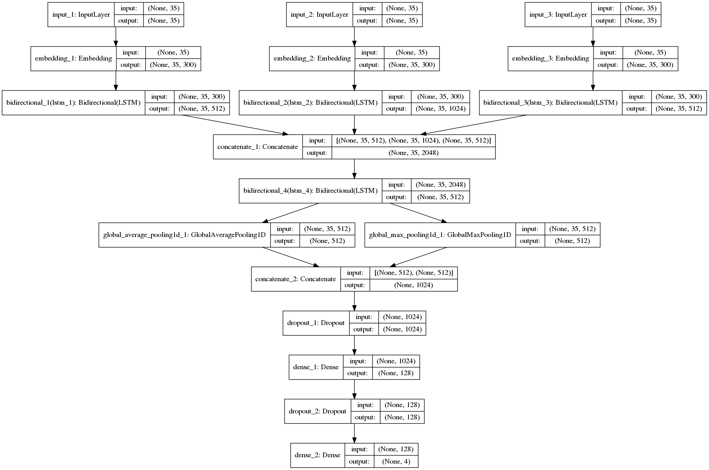

# Emotion Detection from Context (EDC)

The EDC code mainly follows the ideas from the methods/papers in [SEMEVAL 2019 Task-3](https://www.humanizing-ai.com/emocontext.html).


## Table of Contents

1. [Environment Setting Up](#1-environment-setting-up)<br>
   1.1 [Required Dependencies](#11-required-dependencies)<br>
     1.2 [Installation Guide](#12-installation-guide)<br>
2. [Scripts/Directories Introduction](#2-scriptsdirectories-introduction)
3. [Data Pre-processing/Word Embedding](#3-data-pre-processingword-embedding)
4. [Usage and Examples](#4-usage-and-examples)
5. [Neural Network Architecture](#5-neural-network-architecture)
6. [State of The Art](#6-state-of-the-art)
7. [Further Reading](#7-further-reading)
8. [Reference](#reference)


## 1 Environment Setting Up

### 1.1 Required Dependencies
* [Tensorflow 1.14.0](https://www.tensorflow.org/).
* [Keras 2.2.4](https://keras.io/).
* [Python3.6](https://www.python.org/download/releases/3.0/).
* [ekphrasis 0.5.1](https://pypi.org/project/ekphrasis/).

  

### 1.2 Installation Guide
1. Create a virtual environment named ```EDC``` (the benefit of using virtual environment can be found [here](https://www.geeksforgeeks.org/python-virtual-environment/)):

   ```
   $ conda create -n EDC python=3.6
   ```

2. Activate your virtual environment (all the following steps will be done in this activated virtual environment):

   ```
   $ source activate EDC 
   ```

   OR you can use:

   ```
   $ conda activate EDC
   ```

3. Install tensorflow  (more details can be found [here](https://www.tensorflow.org/install)):

   ```
   $ pip install tensorflow
   ```

4. Install keras:

   ```
   $ pip install keras
   ```

5. Install ekphrasis:

   ```
   $ pip install ekphrasis
   ```

   

## 2 Scripts/Directories Introduction

This section introduces the scripts and directories in this implement code.

```
.
├── data                         /*  The directory where the training/validation/test data are resided.
├── references                   /*  The directory where related papers/documents are resided.
├── state_of_the_art_papers      /* The directory where the state-of-the-art papers are resided.
├── config.py                    /* The pre-defined/configuration information about emoji and logograms
├── utils.py                     /* The definitions of gloabl functions and variables.
├── PreProcessing.py             /* The preprocessing code that cleans the raw conversations data.
├── ECNet.py                     /* The core of the code. It defines the neural network architecture and train the model.
├── Useit.py                     /* The usage API.

```


## 3 Data Pre-processing/Word Embedding
The function *file_stat()* calculates the statistics information of dataset and produces the distrution of classes for the dataset which is shown as the flollwoing table. 

The function *clean_data()* pre-processes the raw dataset and finally generates the cleaned dataset and saves them as a separately csv files.

The function *get_embedding_matrix()* conducts the word embedding by leveraging the pre-trained [Glove Embedding](https://nlp.stanford.edu/projects/glove/).


<div align="center">
<p><table>
        <tr>
            <th>LABEL</th>
            <th>TRAIN</th>
            <th>DEV</th>
            <th>TEST</th>
        </tr>
        <tr>
            <th>happy</th>
            <th>4243</th>
            <th>142</th>
            <th>284</th>
        </tr>    
         <tr>
            <th>sad</th>
            <th>5463</th>
            <th>125</th>
            <th>250</th>
        </tr>
         <tr>
            <th>angry</th>
            <th>5506</th>
            <th>150</th>
            <th>298</th>
        </tr>
         <tr>
            <th>others</th>
            <th>14948</th>
            <th>2338</th>
            <th>4677</th>
        </tr>
         <tr>
            <th>TOTAL</th>
            <th>30160</th>
            <th>2755</th>
            <th>5509</th>
        </tr>     
    </table>
    </div>


## 4 Usage and Examples

You can also use the model we have provided in the directory ``` model ``` to test your conversation data.

1.  Place your conversation data in your favorite directory (a example test.csv can be found in the directory ```testdata/```). 

2.  Open your terminal and run the command as follow:

   ```
   $ python Useit.py Your/Data/Path
   ```

An running example result can be seen in the figure below (the last column ```label```  is predicted by using the trained model in ```model/```):

<div align="center">

</div>

**Labels of emotions**
`0:others, 1:happy, 2:sad, 3:angry`

## 5 Neural Network Architecture
The following figure shows the detailed architecture of the neural network.

<div align="center">

</div>

## 6 State of The Art

1. [ICON: Interactive Conversational Memory Network for Multimodal Emotion Detection](https://www.aclweb.org/anthology/D18-1280).
2. [Conversational Memory Network for Emotion Recognition in Dyadic Dialogue Videos](https://www.aclweb.org/anthology/N18-1193).
3. [DialogueRNN: An Attentive RNN for Emotion Detection in Conversations](https://arxiv.org/pdf/1811.00405v4.pdf).
4. [Contextual Emotion detection in Conversations through hierarchical LSTMs and BERT](https://arxiv.org/pdf/1904.00132v2.pdf).
5. [Emotion Classification with Word and Sentence Representations in RCNN](https://arxiv.org/pdf/1902.07867v2.pdf).
6. [Attentive Conversation Modeling for Emotion Detection and Classification](https://www.aclweb.org/anthology/S19-2042).

## 7 Further Reading

* [What Are Word Embeddings for Text?](https://machinelearningmastery.com/what-are-word-embeddings/).
* [How to Prepare Text Data for Deep Learning with Keras](https://machinelearningmastery.com/prepare-text-data-deep-learning-keras/).
* [How to Use Word Embedding Layers for Deep Learning with Keras](https://machinelearningmastery.com/use-word-embedding-layers-deep-learning-keras/).


## Reference
1. [SemEval-2019 Task 3: EmoContext.pdf](https://github.com/taihui/RA_Summer2019/blob/master/3_context_emotion_detection/references/1-SemEval-2019%20Task%203:%20EmoContext).
2. [NELEC at SemEval-2019 2-Task 3: Think Twice Before Going Deep.pdf](https://github.com/taihui/RA_Summer2019/blob/master/3_context_emotion_detection/references/2-NELEC%20at%20SemEval-2019%202-Task%203:%20Think%20Twice%20Before%20Going%20Deep.pdf).
3. [Combined Neural Models for Emotion Classification in Human-Chatbot Conversations.pdf](https://github.com/taihui/RA_Summer2019/blob/master/3_context_emotion_detection/references/3--:%20Combined%20Neural%20Models%20for%20Emotion%20Classification%20in%20Human-Chatbot%20Conversations.pdf).
4. [Attention-based Modeling for Emotion Detection and Classification in Textual Conversations.pdf](https://github.com/taihui/RA_Summer2019/blob/master/3_context_emotion_detection/references/4-%20%20Attention-based%20Modeling%20for%20Emotion%20Detection%20and%20Classification%20in%20Textual%20Conversations.pdf).
5. [Preprocessing-report.pdf](https://github.com/taihui/RA_Summer2019/blob/master/3_context_emotion_detection/references/5-preprocessing-report.pdf).
6. [Multi-Step Ensemble Neural Network for Sentiment Analysis in Textual Conversation.pdf](https://github.com/taihui/RA_Summer2019/blob/master/3_context_emotion_detection/references/6-Multi-Step%20Ensemble%20Neural%20Network%20for%20Sentiment%20Analysis%20in%20Textual%20Conversation.pdf).


